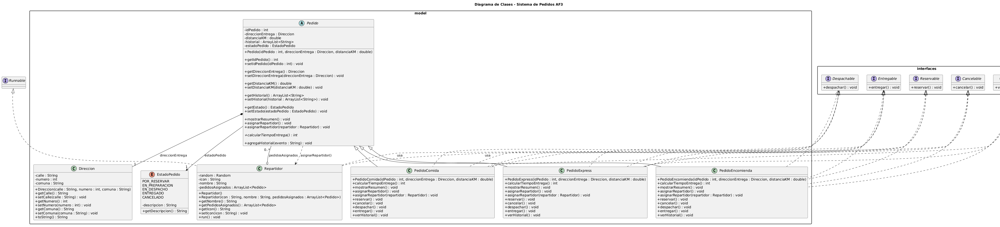

# 🧠 Actividad Formativa 3 – Desarrollo Orientado a Objetos II

## 💻 Proyecto: SpeedFast
## 👤 Autor del proyecto
- **Nombre completo:** Javier Rojas
- **Sección:** PRY2203-001A
- **Carrera:** Analista Programador Computacional
- **Sede:** Online

---

## 📘 Descripción general del sistema
Este proyecto da respuesta a la Actividad Formativa 3 de la asignatura 
*Desarrollo Orientado a Objetos II*. 

En la propuesta se desarrolla la superclase abstracta Pedido con atributos base,
método abstracto calcularTiempoEntrega() y métodos implementados. A partir de esta base
 se crean 3 subclases PedidoComida, PedidoExpress, PedidoEncomienda que heredan de Pedido y además
implementan 5 interfaces que permiten registrar el cambio de estado de un pedido en el flujo de 
entrega:
1. Por reservar <- reservar(), cancelar()
2. En preparación <- despachar()
2. En despacho <- entregar()
3. Entregado
4. Cancelado.

Consideraciones:
- Los pedidos sólo se pueden cancelar mientras están Por reservar. 
- Sólo se puede asignar un/a repartidor/a cuando los pedidos están en estado En preparación.

El sistema creado se organiza en paquetes, aplica principios de herencia 
(Pedido -> PedidoComida, PedidoExpress, PedidoEncomienda),
composición (clase Dirección), encapsulamiento (atributos privados y 
métodos getter/setter), polimorfismo (sobreescritura de métodos), desacoplamiento (interfaces) 
y mantiene documentación de código usando Javadocs.

Adicionalmente en esta actualización, se incorpora concurrencia de tareas mediante hilos
gestionados por objeto ExecuteService.

---

## 🧱 Estructura general del proyecto

```plaintext
docs
└── index.html
src
├── interfaces
│   ├── Cancelable.java
│   ├── Despachable.java
│   ├── Entregable.java
│   ├── Rastreable.java
│   └── Reservable.java
├── model
│   ├── Direccion.java
│   ├── EstadoPedido.java
│   ├── Pedido.java
│   ├── PedidoComida.java
│   ├── PedidoEncomienda.java
│   ├── PedidoExpress.java    
│   └── Repartidor.java 
└── ui
    └── Main.java
````

---

## 🔎 Diagrama de clases



## ⚙️ Instrucciones para clonar y ejecutar el proyecto

1. Clone el repositorio desde GitHub:

```bash
git clone https://github.com/jweb93/DuocUC-POO2-AF3.git
```

2. Abra el proyecto en IntelliJ IDEA.

3. Ejecute el archivo `Main.java` desde el paquete `ui`.

4. Puede revisar la documentación del código accediendo al
archivo `docs/index.html`

---

**Repositorio GitHub:** https://github.com/jweb93/DuocUC-POO2-AF3
**Fecha de entrega:** \[07/09/2026]

---

© Duoc UC | Escuela de Informática y Telecomunicaciones 


